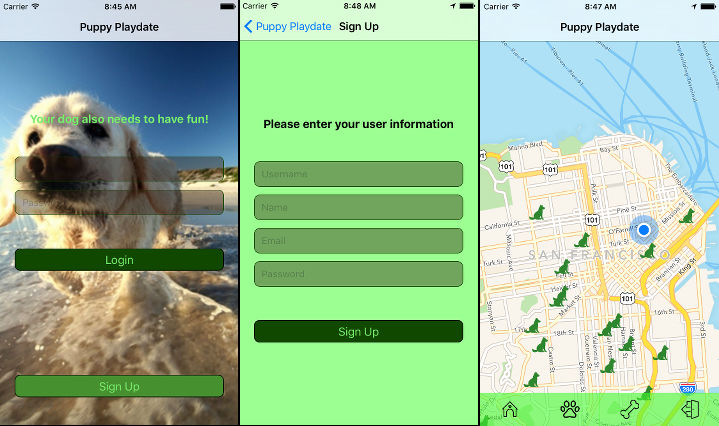
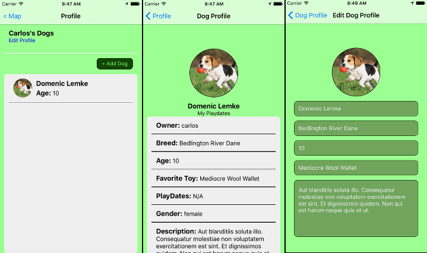
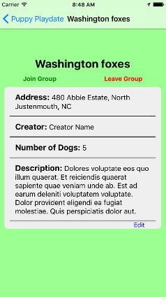
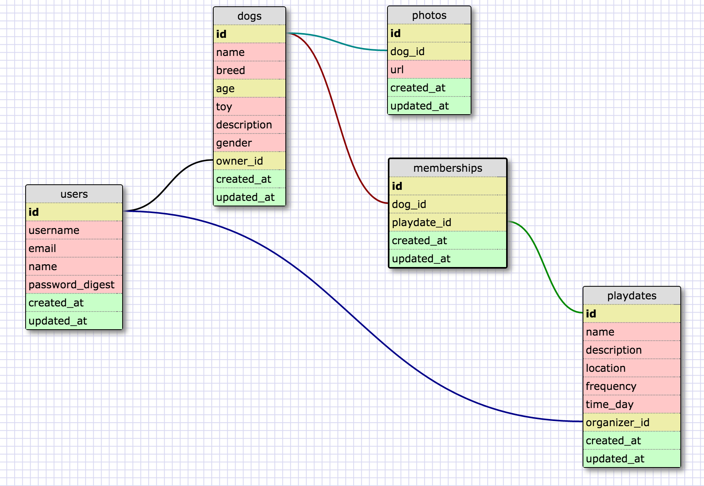

# Puppy Play Date

Puppy Play Date is a community-based network connecting dogs to a healthy environment of other dogs.

## Screenshots





## Team Members:

* [Ryan Wilkins](https://github.com/Tooconfident)
* [Carlos González](https://github.com/cyberpolin)
* [Renan Martins](https://github.com/nbkhope)
* [Buck Melton](https://github.com/buckmelton)

## Technologies

* React Native
* Ruby on Rails
* PostgreSQL

## User Stories

- A group is a collection of dogs, a set regular time and location.

- As a user I can
	- Create an account (sign-up, login)
	- Create a profile for user
	- Create a profile for my dogs
		- photo, name, breed, age, temperment(?), location
	- Look for groups in my area, or in my dog's area, or anywhere on the map
		- Click on the group pin to access group info
			- Choose to join the groups / contact the group creator
		- I can define how far away I want to look
	- Chat with my groups
		- Communicate with my group about status, special events, to build community, provide real-time flexibility for group


	- Create a group with a ... (location, set time)
	- Can make my group private or public
	- Select types of dogs your group is looking for (put tags on groups)
	- Accept new dogs into your group
	- Edit your group details

- A dog joins a group

- A user who has created a group can edit the group.
- A user who has created a group can leave the group, and an email gets sent to all other members of the group saying someone needs to become new creator otherwise group will be deleted within 14 days.


## Database Schema



## Installation (MAC OS X)

You will need Brew, NodeJS and Xcode.

Then, install the React Native command line tools:

```
npm install -g react-native-cli
```

Install Watchman and Flow:
```
brew install watchman

brew install flow
```

To run the application, navigate to its directory and run the command:

```
react-native run-ios
```

### Installation Notes

You might need to also to take care of Node dependencies using

```
npm install
```

In case you get an error where the development server is not running, type:

```
npm start
```

If you have trouble with the version of Node, you can install a newer version using:

```
npm install -g n
n v4.1.2

# Verify the Node version
node -v
```
